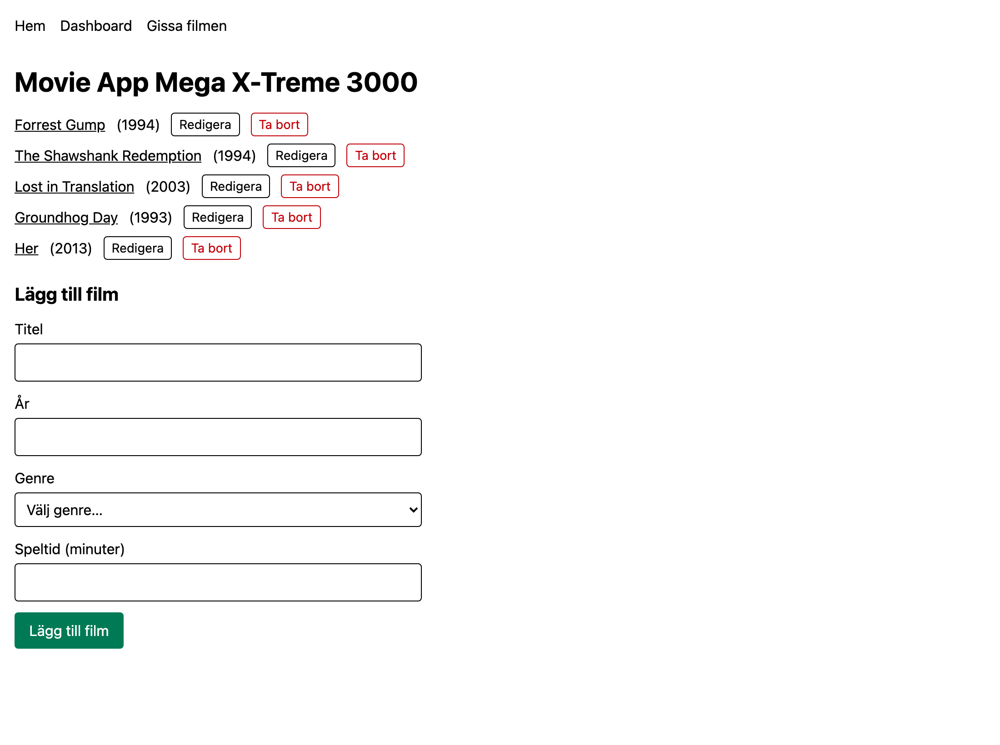
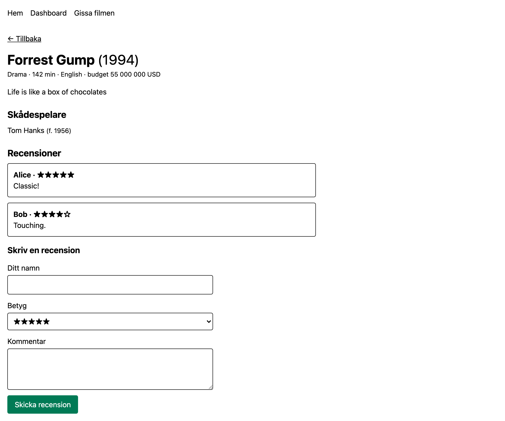
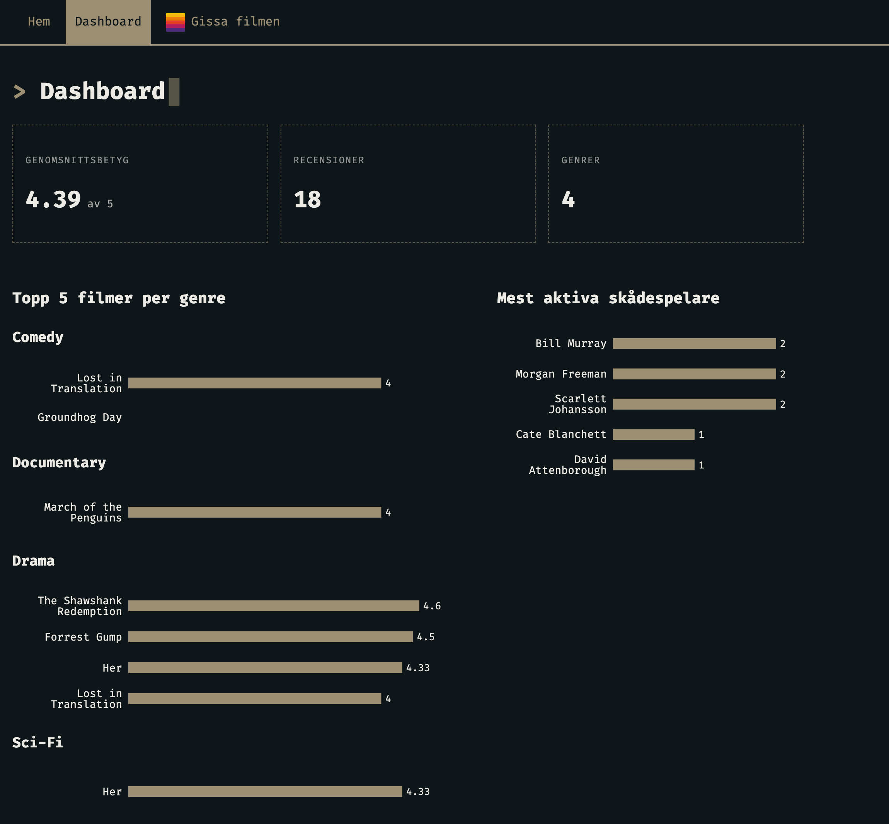
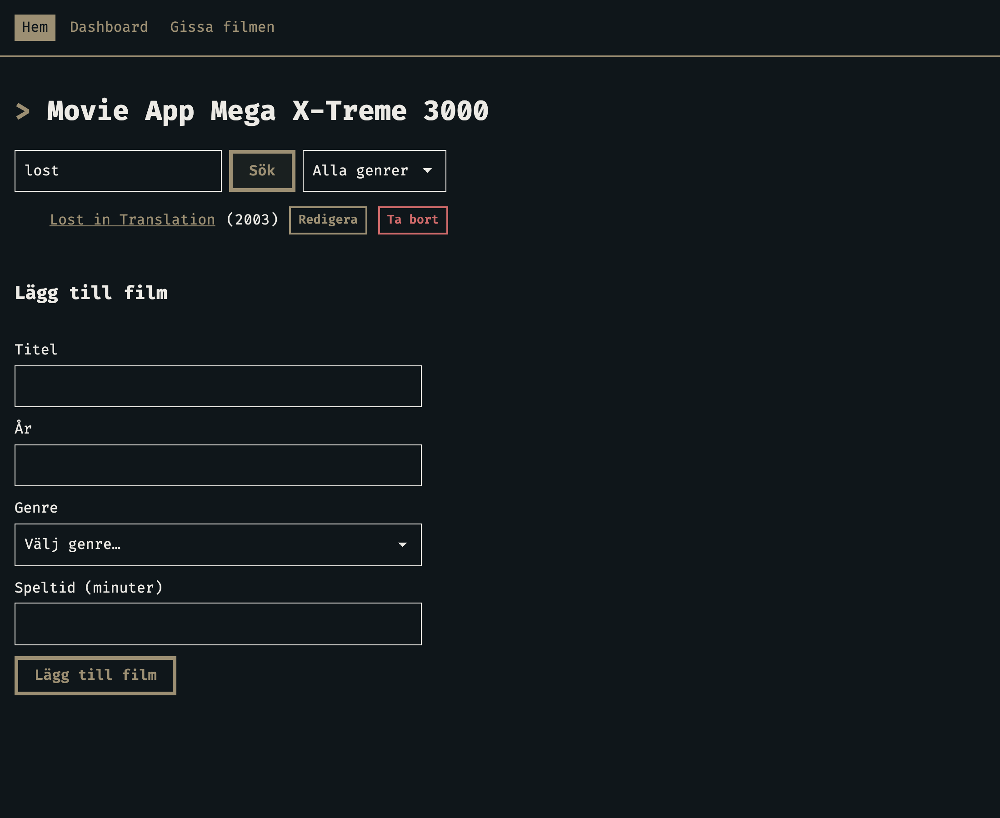
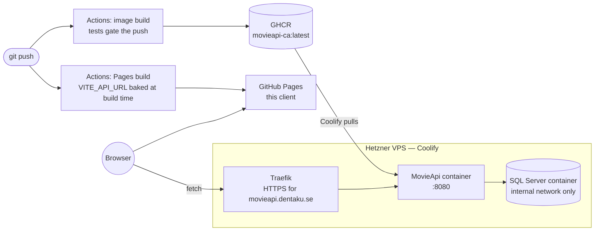
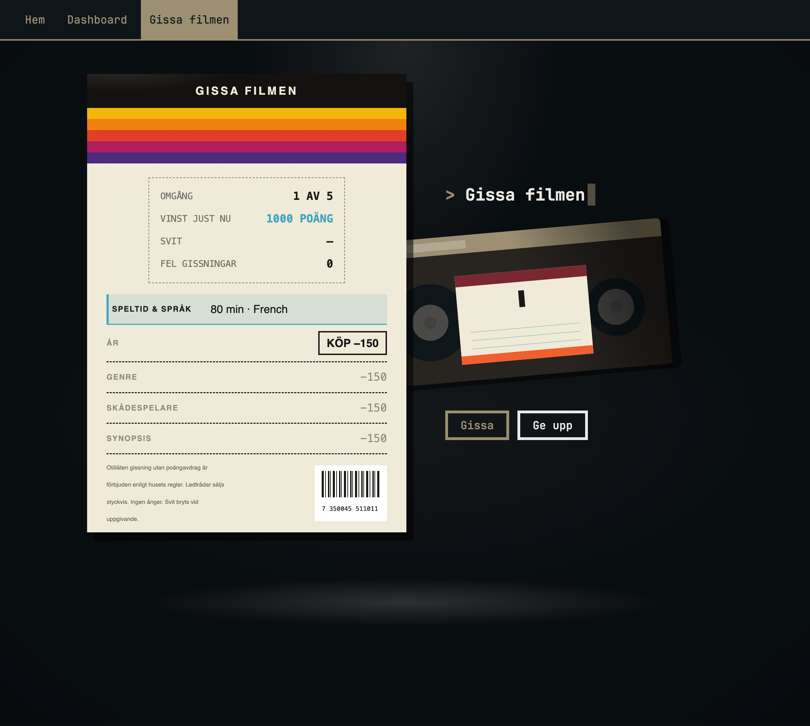

# Movie App Mega X-Treme 3000

A React client for [MovieApi-CA](https://github.com/laszloprekop/MovieApi-CA)
Övning 11 in the Lexicon/LTU frontend course.

- full CRUD over the movie catalogue
- search and genre filter, with the URL as the filter state
- detail pages with reviews and actors — each actor with their role
- admin dashboard with charts
- and ⋆✴︎˚｡⋆ **Gissa filmen** ⟡˙⋆, a quiz built from the catalogue's own data

╭────────────────────.★..─╮

**LIVE DEMO:** [👉 _Movie App Mega X-Treme 3000_ 👈](https://laszloprekop.github.io/fe-11-movie-app/)

╰─..★.────────────────────╯

The live demo is **fully deployed**: this client on GitHub Pages, talking over HTTPS to
[MovieApi-CA](https://github.com/laszloprekop/MovieApi-CA) hosted on a Coolify-managed VPS.
What you click in the demo hits a real API and a real SQL Server.

## Screenshots (the live site)

| The catalogue — search, filter, full CRUD | Detail page — cast with roles, reviews |
|---|---|
|  |  |

| Dashboard — server-side aggregates, Recharts | The URL is the filter state |
|---|---|
|  |  |

## How the pieces fit

Two repos, two deploys, one system:



- **This client** deploys to GitHub Pages on every push. `VITE_API_URL` is baked in at
  build time — the deployed bundle knows exactly one API. Deep links survive refresh via
  the SPA-fallback trick (`404.html`).
- **The API** is built into a Docker image by GitHub Actions (tests must pass first),
  pushed to GHCR, and pulled by Coolify. Traefik terminates HTTPS at
  `movieapi.dentaku.se`; on first boot the API migrates and seeds its own database.
- **SQL Server** runs as a container on the same VPS, reachable only on the internal
  Docker network — no public port.

## Gissa filmen

A quiz built from the catalogue's own data — read-only against the API, so the audience
can play the hosted client live. One round: the free clue opens with the year, the
length and a supporting name; each of the three further clues — språk & genre, the
ensemble, the masked synopsis — costs 150 points, every wrong guess 100, and a correct
guess never pays under 100. Five rounds make *kvällens fem* out of a hundred-film
catalogue; a movie never repeats within a session. Typing offers title suggestions
straight from the catalogue. Best total and best streak persist in `localStorage`.



The rules are pure functions in `src/domain/` — no React imports, unit-tested with
Vitest. The synopsis clue is title-masked (███), so the final clue can never contain
the answer.

## Status

**Done**

- [x] Walking skeleton: routing (`BrowserRouter`, layout + `Outlet`, lazy pages, 404), deployed to Pages with SPA fallback
- [x] Nivå 1 — full CRUD: list with loading/error states, create (with genre dropdown), edit in place, delete
- [x] Nivå 2 — detail pages (`useParams`, `useNavigate`) with actors and reviews; write a review, server rules surfaced as messages
- [x] Nivå 3 — search & genre filter via `useSearchParams`; add actors **with a role** (a real join-entity migration on the API side)
- [x] Nivå 4 — admin dashboard from a `ReportsController`, drawn with Recharts
- [x] API hosted on Coolify — the live demo runs against the real backend
- [x] Terminal look — [terminal.css](https://panr.github.io/terminal-css/) theme over Tailwind
- [x] API work driven by the client: CORS, `GET /api/genres`, a title search filter, cast roles, a reports endpoint, a review-response bug found and fixed
- [x] ⋆✴︎˚｡⋆ **Gissa filmen** ⟡˙⋆ — clue ladder, streaks, records; the rules are tested pure functions
- [x] A8 — the catalogue grows to 100 films of the 90s and 00s, every film with a director; the guess field autocompletes from the catalogue (fuzzy matching retired by it)

## Stack

- React 19 + TypeScript, Vite
- React Router 7 (`BrowserRouter` / `Routes` / `Route`, `useSearchParams`)
- Tailwind 4 + [terminal.css](https://panr.github.io/terminal-css/), Recharts, Vitest
- Backend: [MovieApi-CA](https://github.com/laszloprekop/MovieApi-CA) (.NET 10, Clean
  Architecture) — hosted on a Coolify-managed VPS, SQL Server in a container beside it

## Run it

```bash
npm install
npm run dev     # expects the API base URL in VITE_API_URL (see .env.example)
```

The backend runs beside it: SQL Server in Docker plus `dotnet run` with an overridden
connection string — see [MovieApi-CA](https://github.com/laszloprekop/MovieApi-CA).

Domain vocabulary lives in [CONTEXT.md](CONTEXT.md).
