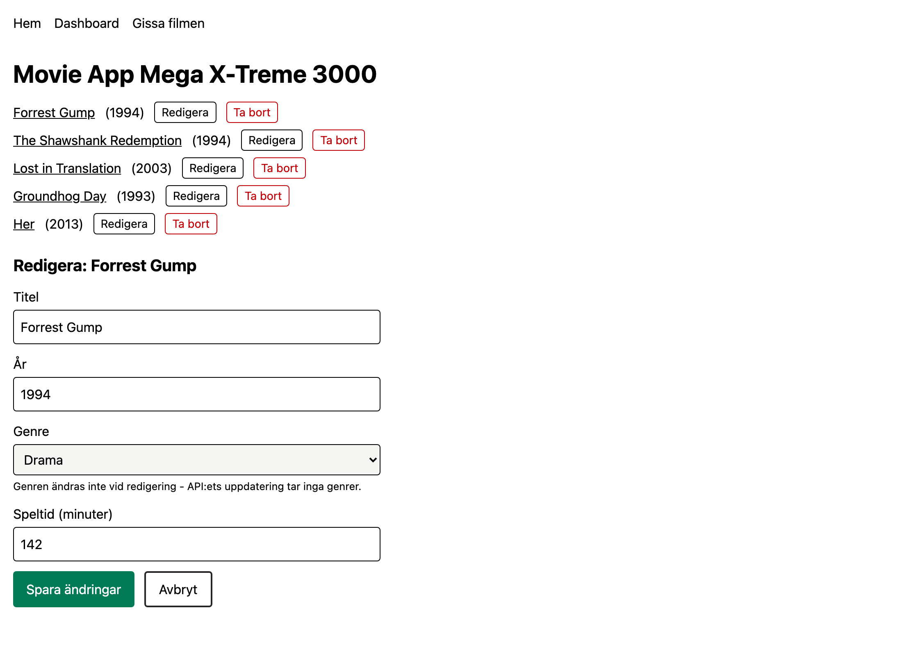
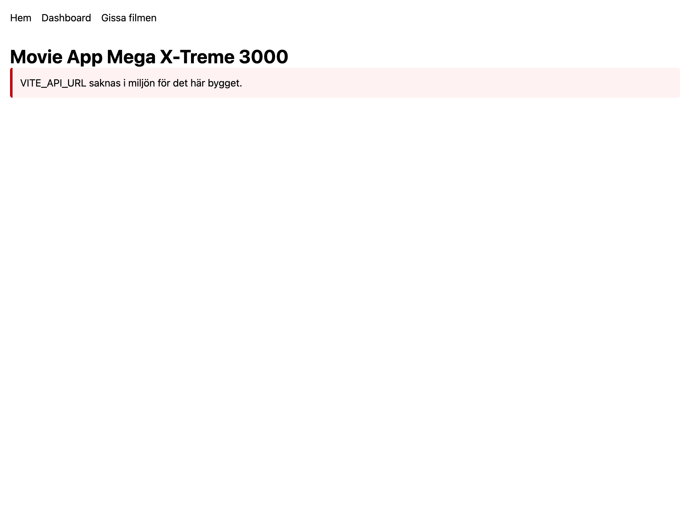

# Movie App Mega X-Treme 3000

A React client for [MovieApi-CA](https://github.com/laszloprekop/MovieApi-CA)
Övning 11 in the Lexicon/LTU frontend course.

- full CRUD over the movie catalogue
- detail pages with reviews and actors
- filtering
- admin dashboard
- and ⋆✴︎˚｡⋆ **Gissa filmen** ⟡˙⋆, a quiz built from the catalogue's own data.

╭────────────────────.★..─╮

**LIVE DEMO:** [👉 _Movie App Mega X-Treme 3000_ 👈](https://laszloprekop.github.io/fe-11-movie-app/)

╰─..★.────────────────────╯

> ⚠️ **The live demo is not yet backed by the server database.** The client is deployed, but the
> API is not hosted yet — so the live site currently greets you with its (honest) configuration
> banner instead of the catalogue. Everything below runs in full against a local backend; the
> hosted API is next on the roadmap.

## Screenshots (local, against the real API)

| The catalogue — list, create form, real genres | Detail page — synopsis, actors, reviews |
|---|---|
|  |  |

| Edit in place — the form switches modes | What the live demo shows today |
|---|---|
|  |  |

## Status

**Done**

- [x] Walking skeleton: routing (`BrowserRouter`, layout + `Outlet`, lazy pages, 404), deployed to Pages with SPA fallback
- [x] Nivå 1 — full CRUD: list with loading/error states, create (with genre dropdown), edit in place, delete
- [x] Nivå 2 — detail pages (`useParams`, `useNavigate`) with actors and reviews; write a review, server rules surfaced as messages
- [x] API work driven by the client: CORS, `GET /api/genres`, a review-response bug found and fixed

**Planned**

- [ ] Host MovieApi-CA on Coolify — wakes the live demo up
- [ ] Nivå 3 — search & genre filter via query strings (`useSearchParams`), add actors with a role
- [ ] Nivå 4 — admin dashboard from a ReportsController, charts
- [ ] ⋆✴︎˚｡⋆ **Gissa filmen** ⟡˙⋆ — the quiz
- [ ] The Mega X-Treme visual pass

## Stack

- React 19 + TypeScript, Vite
- React Router 7 (`BrowserRouter` / `Routes` / `Route`)
- Tailwind 4, Vitest
- Backend: MovieApi-CA (.NET 10, Clean Architecture) — runs locally today, Coolify hosting planned

## Run it

```bash
npm install
npm run dev     # expects the API base URL in VITE_API_URL (see .env.example)
```

The backend runs beside it: SQL Server in Docker plus `dotnet run` with an overridden
connection string — see [MovieApi-CA](https://github.com/laszloprekop/MovieApi-CA).

Domain vocabulary lives in [CONTEXT.md](CONTEXT.md).
